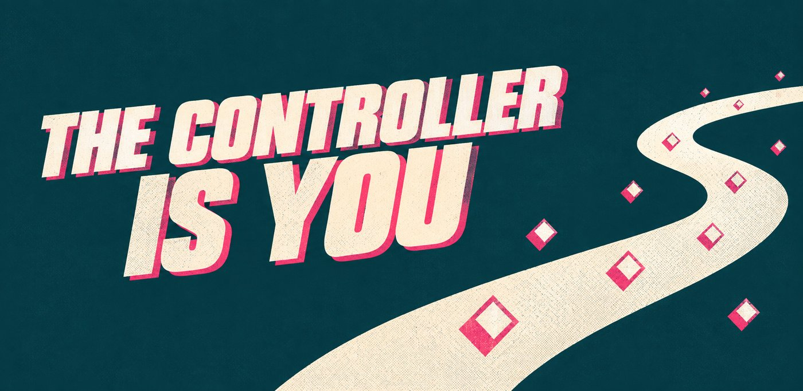
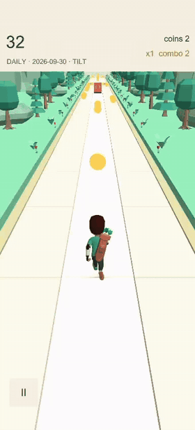
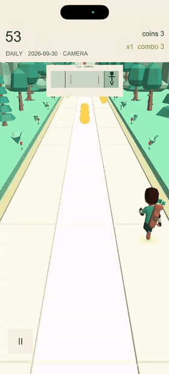
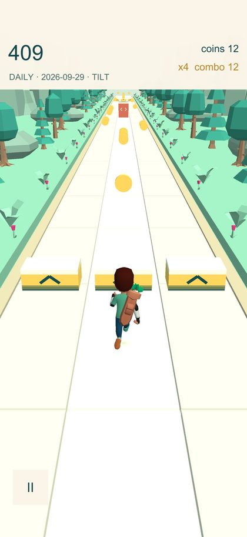
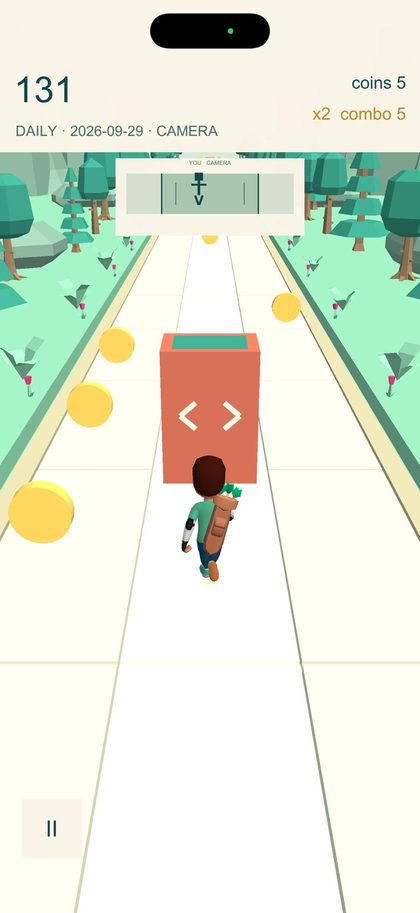
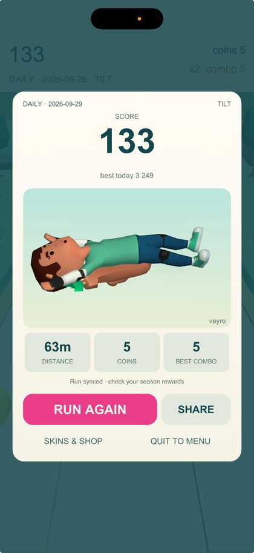
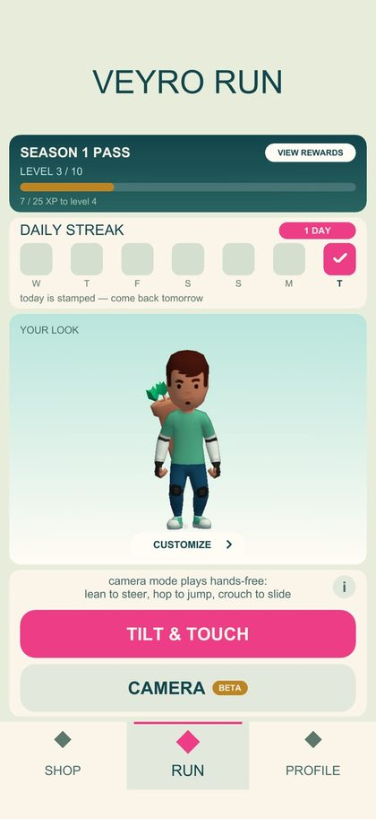
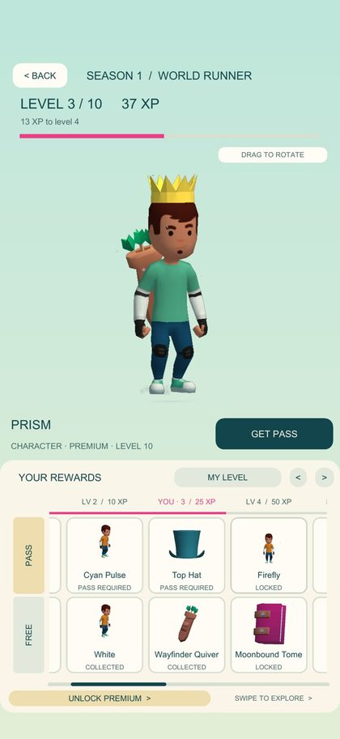
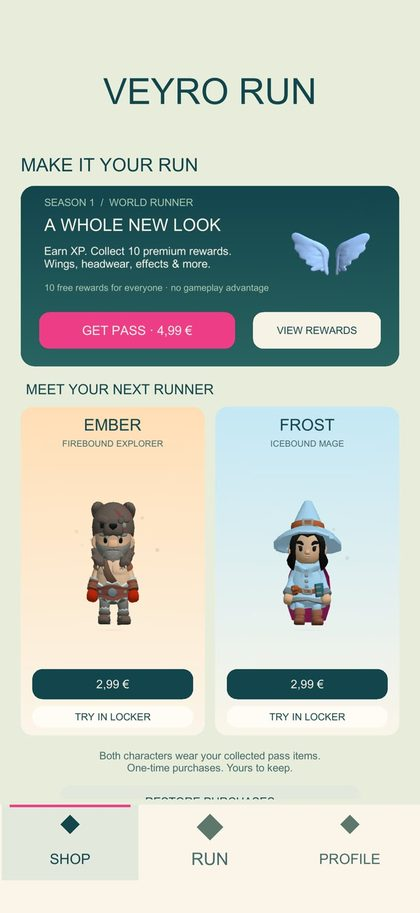

<p align="center">
  
</p>

<p align="center">
  
</p>

<h1 align="center">Veyro Run</h1>

<p align="center">
  An endless runner you play with your body.<br>
  Tilt the phone to steer, or prop it up, step back and run in front of it.<br>
  One shared track for everyone, every day.
</p>

<p align="center">
  <a href="https://veyro.ferrabled.com/">veyro.ferrabled.com</a> ·
  Built for <a href="https://www.shipaton.com/">RevenueCat Shipaton 2026</a>
</p>

<p align="center">
  
  &nbsp;&nbsp;
  
</p>
<p align="center"><sub>Tilt & Touch on the left, Camera mode on the right.</sub></p>

## Why

You've probably seen those YouTube videos where kids run along with an endless runner on the TV. They jump, duck and dodge in the living room as if they were the character, but they're pretending: the video does the same thing whatever they do. Veyro Run is the version that actually watches you. The phone already has a camera pointing at you, so there's no extra hardware, and when you're on the sofa or on the bus the same game works by tilting the phone.

## How you play

It's a three-lane runner with two ways to play. In **Tilt & Touch** you tilt the phone to change lanes and tap to jump. In **Camera mode** (beta) you lean the phone against something, step back a couple of metres and play with your body: a step to the side changes lane and a hop jumps. After a crash you hop to run again, and if you walk out of frame the run pauses until you hop twice, so you never have to walk back and touch the phone. The tracking runs entirely on the phone and no camera image ever leaves it.

The game is built around a daily habit. Every day there's one new track, the **Daily Run**, and it's the same for everyone in the world because it's generated from the date. Finishing it stamps your streak, an optional reminder tells you when tomorrow's track is out, and daily and all-time leaderboards (camera runs have their own) show where you landed. You can also send a friend a link to race your exact track.

<table align="center">
  <tr>
    <td align="center"><br><sub>Daily Run</sub></td>
    <td align="center"><br><sub>Camera mode</sub></td>
    <td align="center"><br><sub>Run again, or challenge a friend</sub></td>
  </tr>
  <tr>
    <td align="center"><br><sub>Season level and daily streak</sub></td>
    <td align="center"><br><sub>Season 1: earned by running</sub></td>
    <td align="center"><br><sub>Cosmetics only</sub></td>
  </tr>
</table>

## Fair by design

Everything for sale is cosmetic: two characters, Ember and Frost, and a Season 1 pass with ten levels of rewards you earn by running. There are no revives, coin doublers, energy or ads. A shared Daily Run only means something if everyone plays the same course under the same rules, so nothing you can buy changes how you play. Purchases go through RevenueCat.

## How it's built

Veyro Run is one Unity 6 project in C#, built for iPhone and Android. The scene is empty and a bootstrap assembles the whole game from code at runtime.

All input goes through a single `IGameInput` interface, with tilt, touch, camera and keyboard as interchangeable adapters, so gameplay never knows which one you're using. Camera mode runs [BlazeFace](https://huggingface.co/unity/inference-engine-blaze-face), a 418 KB face detector, through Unity's Inference Engine on the CPU. The first plan was a full-body pose model, but it took 118 ms per frame on a mid-range phone, against a 30 ms budget. Steering only needs to know where you are, and the face detector answers that in about 3.7 ms. The game measures the phone before it asks for camera permission and falls back to tilt if the camera can't keep up.

The track is generated deterministically from (seed, content version, world), and tests pin the seed hash, so a content change can't silently alter a Daily Run people have already played. Supabase holds profiles, the leaderboard and server-side XP. A OneSignal Journey sends the daily reminder, and each push carries a campaign id into the events sent to Layers, which makes it possible to follow a reminder all the way to a finished run. Analytics are opt-in.

| | |
|---|---|
| Engine | Unity 6 (URP), C# |
| Camera tracking | Unity Inference Engine + BlazeFace, on-device |
| Purchases | RevenueCat `purchases-unity` 9.8.1 |
| Notifications | OneSignal |
| Analytics | Layers (opt-in) |
| Backend | Supabase (Postgres + Edge Functions) |
| Website | Cloudflare Workers |

## Repository

| Path | What's there |
|---|---|
| `game/` | The Unity project. `Assets/Scripts/` holds the code, split by area: gameplay, track, input, camera and pose tracking, menu, commerce, progression, social, notifications, growth and audio |
| `supabase/` | Database migrations and Edge Functions for profiles, runs and the leaderboard |
| `infra/` | A small Cloudflare worker that keeps the backend awake |
| `site/` | The website at veyro.ferrabled.com, including the privacy policy and support pages |
| `docs/` | Design notes, build runbooks, the store kit and the project journal |
| `screenshots/` | Source art for the store listing and the in-game guide |

## Running it

Open `game/` with Unity 6 (6000.x), then open `Assets/Scenes/Main.unity` and press Play. The scene is intentionally empty; `GameBootstrap` builds everything at runtime. In the editor, A/D or the arrow keys steer and Space jumps.

EditMode tests run headless:

```
Unity -batchmode -projectPath game -runTests -testPlatform EditMode
```

Device builds go through `MotionRunner.EditorTools.BuildScript` (`BuildAndroidDev`, `BuildAndroidBundle`, `BuildIOS`). The iOS export is made on Windows and archived on a Mac; `docs/IOS_BUILD_RUNBOOK.md` has the steps.

## Credits

Characters and animations by [Kay Lousberg (KayKit)](https://kaylousberg.itch.io/kaykit-adventurers), [Quaternius](https://quaternius.com/) and [Kenney](https://kenney.nl/), all CC0. Music and sound effects by Kenney, Juhani Junkala, Joth, Wolfgang_, congusbongus and rubberduck, all CC0 from [kenney.nl](https://kenney.nl/) and [OpenGameArt](https://opengameart.org/). The BlazeFace model is Apache-2.0. Sources and licences for every asset are listed in the `SOURCES.md` file next to it.
