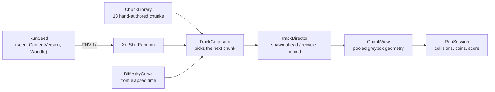

# Track generation — how it works and what to turn

Read this before changing anything about the track: chunks, obstacles, difficulty, speed, or the
art that sits on top of it. Not needed for other work.

Everything described here is code as of 21 Aug 2026 (T-003, T-005, T-008).

## The model in one paragraph

The runner never moves forward. It sits at `z = 0` and slides left/right; the **world moves toward
the camera** (handoff §3.1), which makes chunk management cheap and predictable. `TrackDirector`
keeps a running `z` cursor and lays chunks **end to end** from it, so a gap between chunks is not
something the code avoids — it is something the code cannot express. A run is fully determined by
its seed: same seed ⇒ same chunk order, same obstacles, same coins, on every device.

## Where the code lives, and why it is split

| Assembly | Path | Rule |
|---|---|---|
| `MotionRunner.Track` | `game/Assets/Scripts/Track/` | **Pure C#** — `noEngineReferences: true`, imports only `System`. All generation, geometry and scoring logic. |
| `Assembly-CSharp` | `game/Assets/Scripts/Gameplay/`, `Core/` | Unity side: MonoBehaviours, rendering, input, PlayerPrefs. |

**Put new logic in `MotionRunner.Track` whenever it can go there.** That assembly is why 81 tests
run headlessly in about a quarter of a second, why the same numbers come out on Mono in the editor
and IL2CPP on the phone, and why this layer can be worked on from a machine with no Unity installed.
The moment it references `UnityEngine`, all of that stops being true.

## A run is a seed

`RunSeed(seed, contentVersion, worldId)` → FNV-1a hash → 32-bit state → `XorShiftRandom`.

| Field | What it is | Change it when |
|---|---|---|
| `seed` | Daily Run: the UTC date as `yyyyMMdd` (`DailySeed`). Free mode: a per-run value. | Never by hand. |
| `contentVersion` | `ChunkLibrary.ContentVersion`, currently `"greybox-1"`. | **Every time the chunk library changes** — see below. |
| `worldId` | `"greybox"`. Reserved for biomes. | A new world gets its own daily tracks for free. |

Deliberately **not** in the seed: the application version. A bugfix release must not fork the day's
players onto different tracks.

Both the hash and the PRNG are hand-rolled, because neither `string.GetHashCode()` nor
`System.Random`'s stream is stable across runtimes, and the Daily Run needs the editor and the phone
to agree. `RunSeedTests` and `DailySeedTests` **pin** their outputs.

> **If a pinned test fails, do not update the expected value to make it pass.** It means every
> already-published Daily Run just changed. Either you broke the hash — fix it — or you changed the
> content on purpose, in which case bump `ContentVersion` and *then* recompute the pinned states
> (run the test, copy the actual value from the failure message).

## Anatomy of a chunk

`ChunkDefinition` (`Track/ChunkDefinition.cs`) carries the handoff §4.3 metadata:

| Field | Used today for |
|---|---|
| `ChunkId` | Identity, pool key, debugging. Must be unique. |
| `Biome` | Reserved — one biome at launch. |
| `DifficultyMin/Max` | The generator only offers a chunk inside this window. |
| `Length` | World-space metres. The `z` cursor advances by exactly this. |
| `EntryType` / `ExitType` | `ChunkEdge.Ground` or `Bridge`. A chunk may only follow one whose `ExitType` equals its `EntryType`. |
| `RequiredSkills` | `Jump` / `LaneChange` / `Slide`. Must match the obstacles present — the validator enforces it. `Slide` is unused (v1.0 ships left/right/jump only, per handoff §2.3). |
| `Tags` | `Start`, `Straight`, `Coins`, `Bridge`, `Tunnel`, `Scenic`, `RiskReward`, `SetPiece`. Drive visuals (`Bridge` → railings, `Tunnel` → arches) and selection (`Start`). |
| `Rarity` | Selection weight. 1 = common, below 1 = rarer. Not a probability — weights are summed. |
| `Obstacles` / `Coins` | Placements at `(lane, z)` where lane is −1/0/+1 and `z` is metres from the chunk start. |
| `Clusters` | Computed, not authored: obstacles grouped by `z`. This is what the playability rules operate on. |

### The current library (13 chunks)

| Chunk | Difficulty | Length | Edges | Rarity | Notes |
|---|---|---|---|---|---|
| `start_flat` | 1 | 36 | G→G | 1.0 | `Start`. Always first, always obstacle-free. |
| `straight_coins` | 1–3 | 24 | G→G | 1.3 | Coins only. |
| `hop_gate` | 1–4 | 24 | G→G | 1.1 | One full-width low barrier: must jump. |
| `weave_blocks` | 2–5 | 28 | G→G | 1.1 | Three single-lane blocks. |
| `gate_pair` | 3–6 | 28 | G→G | 1.0 | Two lanes blocked, one gap. |
| `hop_run` | 4–8 | 32 | G→G | 0.9 | Three jump gates. |
| `mixed_pattern` | 5–8 | 32 | G→G | 0.8 | `SetPiece` — jump *and* steer. |
| `tunnel_dash` | 3–7 | 26 | G→G | 0.7 | `Tunnel` visuals. |
| `coin_dash` | 1–6 | 24 | G→G | 0.6 | `RiskReward` coin line past a block. |
| `bridge_on` | 2–8 | 20 | G→B | 0.7 | The only way onto a bridge. |
| `bridge_span` | 2–8 | 28 | B→B | 1.0 | Coins. |
| `bridge_gate` | 4–8 | 28 | B→B | 0.8 | Blocks on a bridge. |
| `bridge_off` | 2–8 | 20 | B→G | 1.2 | The only way off a bridge. |

## How the generator picks the next chunk

`TrackGenerator.Next(difficulty)`:

1. **First chunk of a run** → the `Start`-tagged chunk, always, regardless of seed.
2. Build candidates by scanning the library **in fixed order** (this is what makes it deterministic):
   - `EntryType` must equal the current open edge;
   - skip `Start`-tagged chunks;
   - if the last 3 chunks all exited onto a bridge (`MaxBridgeRun`), require `ExitType != Bridge`;
   - `DifficultyMin ≤ difficulty ≤ DifficultyMax`.
3. Drop the previous chunk's id, so nothing repeats back to back — unless that would empty the list.
4. Pick one, weighted by `Rarity`.
5. If step 2 found nothing, retry **without** the difficulty filter and count it in `RelaxedCount`.
   A healthy library never relaxes; `TrackGeneratorTests` asserts `RelaxedCount == 0`.

## Difficulty and speed

| Knob | Where | Value | Effect |
|---|---|---|---|
| `SecondsPerStep` | `DifficultyCurve` | 45 | Difficulty is `1 + floor(seconds / 45)`. |
| `MaxDifficulty` | `DifficultyCurve` | 8 | Ceiling; reached at 315 s. |
| `BaseSpeed` | `TrackMetrics` | 12 m/s | World speed at difficulty 1. |
| `SpeedPerDifficulty` | `TrackMetrics` | 1.1 m/s | Speed is `12 + (d − 1) × 1.1`, so 19.7 m/s at d8. |

Difficulty is a property of chunks, not just a speed multiplier (handoff §3.2) — raising the curve
makes the generator *offer different chunks*, not merely run the same ones faster.

**Careful:** reaction distance is measured in **metres** (`MinClusterSpacing = 6`), so raising speed
silently shortens reaction *time*. At 12 m/s, 6 m is 0.5 s; at 19.7 m/s it is 0.3 s. If speed goes
much higher, make the spacing scale with speed rather than nudging the constant.

## The playability rules

`ChunkDefinition.Validate()` returns `null` for a good chunk, otherwise the reason. Every library
chunk is validated by a test, so unplayable content cannot reach a build. It rejects:

- a cluster that blocks **all three lanes** with full blocks — impossible;
- two clusters closer than `MinClusterSpacing` (6 m) — no reaction time;
- any obstacle within `ChunkEdgeClearance` (3 m) of the chunk's start or end. **This is what makes
  the 6 m rule hold across chunk seams too** (3 + 3 = 6), which no single chunk could guarantee alone;
- two obstacles stacked in one lane in one cluster;
- a low barrier without `RunnerSkill.Jump`, or a full block without `RunnerSkill.LaneChange`;
- a coin buried inside an obstacle, i.e. unreachable;
- a bridge edge without the `Bridge` tag; bad difficulty ranges; non-positive rarity.

## The geometry, and why the numbers are what they are

| Thing | Half-extents (x, y, z) | Sits at |
|---|---|---|
| Lane | width 1.6, centres at −1.6 / 0 / +1.6 | road half-width 2.4 |
| Runner | 0.3, 0.5, 0.3 | rest `y = 0.5` |
| Low barrier | 0.62, 0.25, 0.35 | top at `y = 0.5` |
| Full block | 0.62, 0.90, 0.45 | top at `y = 1.8` |
| Coin | 0.4 cube | centre `y = 0.95` |

Collision is **AABB interval tests**, not PhysX (CLAUDE.md rule 4) — deterministic, and a few dozen
interval comparisons per frame (only chunks within a small `z` window of the runner are examined).
Colliders that `CreatePrimitive` attaches are destroyed on creation.

The jump is manual ballistics: `JumpVelocity 7.5`, `Gravity 22` → **apex `y ≈ 1.78`**, airtime
`≈ 0.68 s`. That single pair of numbers is what makes the two obstacle kinds mean different things:

- a **low barrier** is cleared while `y ≥ 1.0`, which is ~78 % of the airtime — forgiving on purpose;
- a **full block** still overlaps the runner at the apex, so it can *only* be steered around.

Change `JumpVelocity`, `Gravity`, or either obstacle's height and you are changing that contract.
`TrackGeometryTests` asserts both properties and will tell you if you broke one.

Lateral clearance: a full block plus the runner is `0.62 + 0.3 = 0.92`, so a lane is clear once the
runner is more than 0.92 m from the block's centre — 0.68 m of slack at the neighbouring lane centre.
Steering is analog, so the player never has to reach an exact lane centre.

## Spawning, recycling, pooling

| Knob | Where | Value | Meaning |
|---|---|---|---|
| `SpawnAheadDistance` | `TrackDirector` | 130 m | Keep laying chunks until the cursor is this far ahead (5–7 chunks). |
| `RecycleBehindZ` | `TrackDirector` | −24 m | Return a chunk to the pool once its end is this far behind. |
| `FirstChunkZ` | `TrackDirector` | −8 m | The first chunk starts *behind* the runner — the camera sees back to about −3.4, so starting at 0 leaves a visible hole. |

Views are **pooled per `chunkId`**, so each definition's geometry is built once per session and then
only moved and reset. That is what keeps memory flat over a ten-minute run. `ChunkView` state that
must reset between passes (currently just which coins were taken) belongs in `PrepareForReuse()`.

## Cookbook

### Add or edit a chunk
Edit `ChunkLibrary.Build()`. Then **bump `ChunkLibrary.ContentVersion`** — it is part of every seed,
so a stale version means two players on the same daily seed running different tracks. Expect
`DailySeedTests.RngStateForKnownDates_IsPinned` to fail on its guard assert: that is the reminder,
not a bug. Recompute the three pinned states from the failure output.

The validator and the library tests will catch: a duplicate id, an unplayable cluster, obstacles too
close together or too near an edge, undeclared skills, buried coins, and difficulty-coverage holes
(every difficulty needs **at least two** Ground→Ground candidates so nothing repeats back to back).

### Retune the difficulty ramp
`DifficultyCurve.SecondsPerStep` and `MaxDifficulty`. Raising `MaxDifficulty` means the library must
cover the new levels, or `RelaxedCount` stops being zero. Two tests encode intent from handoff §3.2 —
minute 1 easy, minute 5 hard — so if you change the shape, change those deliberately.

### Make the game faster or slower
`TrackMetrics.BaseSpeed` / `SpeedPerDifficulty`. Re-read the reaction-time warning above.

### Add an obstacle kind
`ObstacleKind` enum → half-extents in `TrackMetrics` → `TrackGeometry.Obstacle` → a colour in
`ChunkView.BuildObstacle` → the skill and cluster rules in `Validate()`. Decide first whether it
blocks a lane, because the cluster masks are built on exactly that distinction.

### Add an edge type (something like the bridge)
`ChunkEdge` enum, then give the library at least one chunk that enters it and one that leaves it, at
every difficulty where it is reachable — otherwise the generator can dead-end.
`ChunkLibraryTests.EveryEdge_CanBeEnteredAndLeft` and the bridge-escape test cover this shape.

### Change scoring
`ScoreState` (`CoinBaseValue` 10, `ComboWindowSeconds` 2.5, `ComboCoinsPerStep` 3,
`MaxComboMultiplier` 5). See OPEN_QUESTIONS — the intent is to freeze this at first release, because
leaderboards make old scores incomparable afterwards.

## Assets, and what the art pass must not break

Right now there are **no art assets at all**. Every visible thing is a primitive created in code by
`ChunkView`, tinted with `RuntimeMaterials.Shared(color)`: deck segments (6 m, 0.12 m gaps), lane
stripes, bridge railings, tunnel arches, obstacle boxes, and coin cubes rotated 45° to read as gems.

When T-006 brings real art, four things have to survive:

1. **Never primitive default materials.** Player builds hand `CreatePrimitive` objects the built-in
   Standard material, which URP cannot render (CLAUDE.md gotcha 3). Always go through
   `RuntimeMaterials`.
2. **Keep generation data free of `UnityEngine`.** Chunks become ScriptableObjects in T-006 — the SO
   should *carry or produce* a `ChunkDefinition`, not replace it. If `ChunkDefinition` starts
   referencing prefabs or `Vector3`, the whole headless test suite dies with it.
3. **Respect the pooling contract.** `ChunkView` builds once, then only `PlaceAt` / `Translate` /
   `PrepareForReuse`. Art that instantiates per pass, or holds state that survives a reuse, will
   show up as a memory slope over a long run.
4. **Git LFS before the first binary asset** (D2 in PREREQUISITES), not after.

A custom static splash image would also live here — the Unity splash is off, but the black frame
during engine startup can be replaced with artwork.

## Tests

`Unity -batchmode -projectPath game -runTests -testPlatform EditMode` — 81 tests, ~0.25 s.

| File | Covers |
|---|---|
| `RunSeedTests` | Seed hash and PRNG stream, **pinned** |
| `DailySeedTests` | Daily Run: same date ⇒ same run, dates differ, content-version behaviour, **pinned** |
| `ChunkLibraryTests` | Every chunk valid; library coverage and connectivity; the validator's own rejections |
| `TrackGeneratorTests` | Determinism, edge matching, difficulty window, no repeats, bridge cap, cross-seam spacing |
| `TrackGeometryTests` | Jump-vs-obstacle contract, lane clearance, coins, difficulty curve, speed |
| `ScoreStateTests` | Distance, coins, combo window, multiplier cap |
| `HudFontTests` | The built-in font RunHud depends on still resolving |

`ChunkView`, `TrackDirector`, `RunSession` and `RunHud` are **not** unit-tested: they live in
`Assembly-CSharp`, which an assembly-definition test project is not allowed to reference. They are
covered by on-device verification instead.
